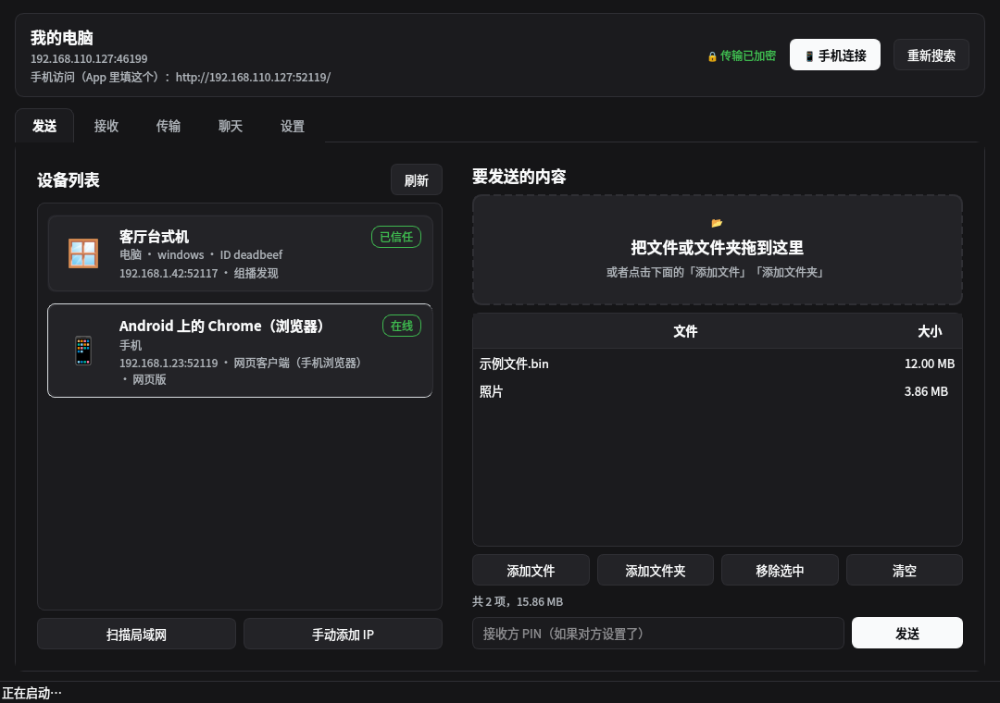
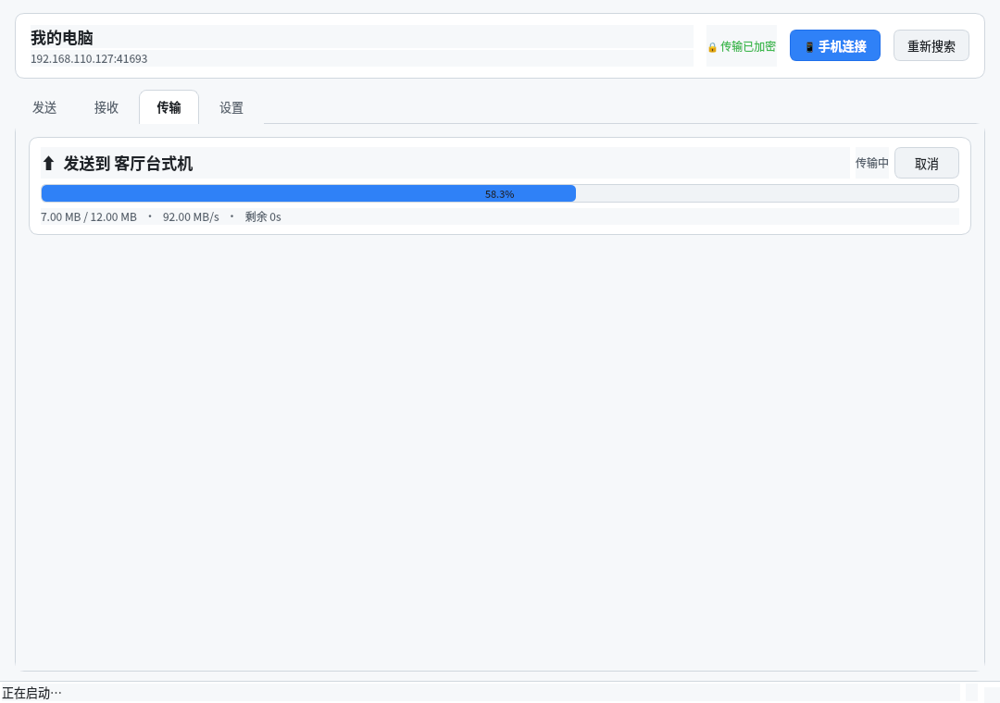
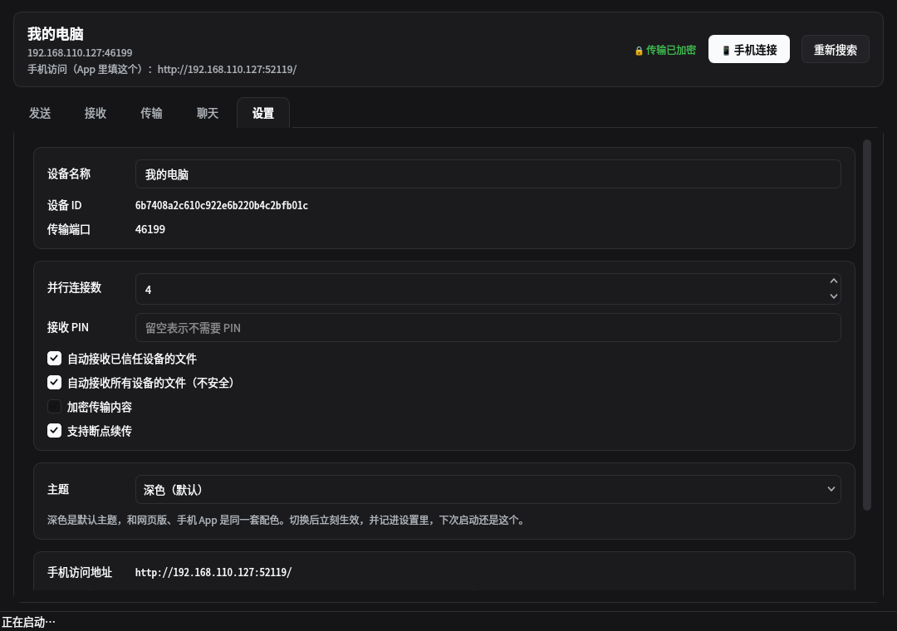

<div align="center">

# 韧传 · EverSend

**跨平台、绿色便携、专为大文件优化的文件互传工具 —— 断了能续传，坏了只补坏的那几块。**

**A portable cross-platform file transfer tool built for large files: it resumes after a drop and repairs only the damaged chunks.**

**简体中文** · [English](#-english)


[](https://github.com/xugulin/eversend/actions/workflows/ci.yml)
[](https://github.com/xugulin/eversend/actions/workflows/interop.yml)

</div>



## 📸 截图 · Screenshots

|  |  |
|---|---|
|  |  |
| **发送 · Send**<br>左边选设备、右边拖文件，实时速度与剩余时间<br>*Pick a device, drop files, live speed and ETA* | **传输 · Transfers**<br>多流并行进度、断流后自动补流继续<br>*Parallel-stream progress; reconnects by itself after a drop* |
|  |  |
| **设置 · Settings**<br>并行连接数、PIN、自动接收、加密状态<br>*Stream count, PIN, auto-accept, encryption state* | **手机连接 · Phone**<br>扫码即用，手机不装任何 App<br>*Scan and go — nothing to install on the phone* |

> 截图摄于本机实跑，默认 1080×760 窗口。
> *Captured from a real run at the default 1080×760 window.*

---

## 🇨🇳 简体中文

### 平台与验证 · Platforms & verification

| 平台 | 状态 | 怎么验证的 |
|---|---|---|
| **Linux** | ✅ 完整支持 | 作者实机 + GitHub Actions `ubuntu-latest` 原生 runner：33 项内核测试、17 项恶劣网络测试、7 项并发测试、132 项浏览器界面自检、真 Qt 离屏渲染 |
| **Windows** | ✅ 完整支持 | GitHub Actions `windows-latest` 原生 runner 跑同一整套；另有 `interop.yml` 由 **Wine 承载真 Windows CPython + win_amd64 轮子**与 Linux 双向互传 24 MiB，逐字节比对；`ci.yml` 再把**绿色包解压到「我的 U 盘」这样的中文带空格路径**，用包里自带的解释器跑传输与界面 |
| **安卓** | ✅ 浏览器界面（零安装） | GitHub Actions 真机模拟器（API 34）+ 真 Chrome：CDP 把文件塞进页面的文件选择框再点发送，上传下载都逐字节比对 |
| **macOS** | ⚠️ 内核已验证，**界面未验证** | GitHub Actions `macos-latest` 跑完整内核测试（含 512 MiB 传输与内存上界），但作者没有 Mac，桌面窗口从未在真机上看过 |

> **这些不是"应该能跑"，是 CI 上真跑过。** 跨系统的测试至今抓到 4 个只在某个平台上
> 存在、在作者本机永远是绿的缺陷：`os.pread/os.pwrite` 在 Windows 上不存在、
> Windows 的 `os.open` 默认文本模式会悄悄改写二进制、Windows 上 `socket.sendmsg`
> 不存在、以及**手动接受的传输在 Windows 上会因为文件还被自己开着而重命名失败**
> （POSIX 允许重命名打开着的文件，所以 Linux 侧一直只表现为句柄泄漏）。
> 详见 [`docs/RESEARCH.md`](docs/RESEARCH.md) 与 `ci.yml` / `interop.yml` 里的注释。

### 这是什么

**韧传**是一个从零写的文件互传工具：局域网内点对点直连，不经过任何服务器；手机扫码就能用；
绿色包解压即用，**解压到 U 盘里也能跑**。

它的起点是两份源码的逐行研读：[LocalSend](https://github.com/localsend/localsend) 和
[RustDesk](https://github.com/rustdesk)。两者都很优秀，但在"稳定传大文件"这件事上各有
**设计层面**的硬伤，不是调参能解决的：

- **LocalSend 完全没有断点续传**：整个文件就是一个 HTTP POST，传到 99% 断了只能从 0 开始。
  它那个"重试 3 次"只对**校验和不匹配**生效，网络中断根本不在重试范围内。而且上传严格绑定
  源 IP —— 在多网卡机器上（Windows 上 Wi-Fi + Hyper-V + WSL 是常态）会直接 403。
- **RustDesk 的文件传输是"每 tick 一块"的定时器模型**：块固定 128 KiB、被控端 5 ms/tick，
  **26–29 MB/s 是设计硬顶**；块号字段恒为 0（没有偏移），无逐块 ACK、无滑窗、无重传；
  续传只靠 `(size, mtime 秒)`，没有内容哈希，偏移还是 `uint32`，**截断在 4 GiB**。

韧传保留了 LocalSend 那种"打开就能看见对方"的体验和 RustDesk 的穿透思路，把传输层整个换掉。
完整的解剖报告在 [`docs/RESEARCH.md`](docs/RESEARCH.md)。

### 为什么值得一试

**它的核心是"接收方驱动"。** 每一块数据都是接收方要来的，不是发送方推的。三个好处直接掉出来：

1. **续传免费** —— 续传日志在接收方手里，重连后它只是"不请求已经有的块"。不需要交换位图、
   不需要协商、不需要从头再来。
2. **负载自动均衡** —— 所有流从一个共享队列取任务，快的自然拿得多，不需要调参。一条流死了，
   它在飞的块回到队列被别的流接走。
3. **发送方无状态** —— 它只回答"第几块是什么"，无论多少条流，内存里永远只有一个块。

再叠一条：**块按文件顺序发放**，多条流合起来就是**从前往后顺序写盘**（机械硬盘上这是
120 MB/s 与 20 MB/s 的差距），并且让整文件哈希能边传边算，正常情况完全不用传完再读一遍。

### 功能一览

- **分片传输**：1–16 MiB 自适应分块，逐块 CRC32 + 整文件 BLAKE2b-256
- **断点续传**：断电、断网、关程序、拔 U 盘，下次接着传
- **坏块修复**：校验失败只重取坏的那几块 —— 100 GB 坏一个扇区，代价是 4 MB 而不是 100 GB
- **多连接并行**：默认 4 条最多 16 条，机械硬盘自动降为 2 条
- **断连自愈**：Wi-Fi 漫游、NAT 重绑定导致连接全灭后自动补流并完成
- **五种发现方式**：UDP 组播、UDP 广播、mDNS、主动子网扫描、手动 IP/二维码
- **传输加密**：Ed25519 身份 + X25519 协商 + AES-256-GCM/ChaCha20-Poly1305，6 位短认证串
- **手机零安装**：内置移动端网页界面，扫码即用，支持断点下载（HTTP Range）
- **绿色便携**：内置 Python 3.14.7，不写注册表、不写 `%APPDATA%`，只读介质也能启动

### 快速开始

**绿色版（推荐）**：从 [Releases](https://github.com/xugulin/eversend/releases) 下载对应的
zip，解压后

- **Linux**：`./run.sh`
- **Windows**：双击 `run.bat`

不需要装 Python、不需要装依赖、不需要联网。

**从源码**：

```bash
git clone https://github.com/xugulin/eversend
cd eversend
python3 -m venv .venv
.venv/bin/pip install PySide6-Essentials cryptography
PYTHONPATH=src .venv/bin/python -m eversend
```

**命令行**（无图形界面的服务器也能用）：

```bash
python -m eversend --cli serve --auto-accept   # 常驻收文件
python -m eversend --cli discover              # 看看局域网里有哪些设备
python -m eversend --cli send 文件 --to 192.168.1.42
python -m eversend --cli selftest              # 自检
```

### 手机怎么用

PySide6 官方不支持 Android，所以手机端走浏览器：电脑上点「📱 手机连接」，用相机扫码，
手机浏览器里就是完整界面。手机和电脑在同一个 Wi-Fi 下即可，**手机上不需要安装任何东西**。

手机**只要连过一次就会被记住**（写进 `data_dir/web_clients.json`）：熄屏、切到别的
App、甚至把浏览器整个关掉，它都留在设备列表里，状态只是从「在线」变成
「未连接 · 最后在线 3 分钟前」—— **不需要为了保持配对而让手机一直亮着**。
想让它彻底消失，只有在手机上点「断开连接」，或者在电脑上右键那台设备选「移除」。

选择接收设备时，每台设备是一张大卡片：34px 平台图标、设备名（会换行）、
`类型 · 系统 · 版本 · ID`、`地址 · 怎么发现的 · 最后在线`，右侧一个状态徽标
（在线 / 未连接 / 已信任 / 本机实例）。名字相近的两台设备靠设备 ID 区分，避免发错人。
悬停能看到完整信息，包括对方自报的地址列表。

手机出现在三处：**左侧设备列表里的卡片**、扫码弹窗的状态行、
「设置 → 已连接的手机」。（这些同时是接口 `/api/state` 的 `webClients` /
`knownClients` 字段，脚本一样能查。）

**两个方向都能用，但机制不同，界面上也如实写明：**

- **手机 → 电脑**：手机上选文件，页面直接传过来（单个文件上限 32 GB）。
- **电脑 → 手机**：选中设备列表里那台手机，点「发送」——文件会被**交给手机页面**，
  手机「接收」页出现「电脑发来的文件」，点一下「下载」就取走（HTTP Range 断点续传）。
  浏览器里没有常驻的接收服务，所以这不是推送，而是一次交接；传输行会显示
  「已放到手机页面，等它在手机上点下载」，手机取走后变成「手机已取走」。
  把这件事说清楚，比给一个永远不会到达的「已发送」要好。

脚本也能做同样的事（仅本机可调）：

```bash
TOKEN=$(curl -s http://127.0.0.1:52119/ | grep -o 'name="eversend-token" content="[^"]*"' | cut -d'"' -f4)
curl -X POST -H "X-EverSend-Token: $TOKEN" -H 'Content-Type: application/json' \
     -d '{"paths":["/home/me/报告.pdf"]}' http://127.0.0.1:52119/api/share
```

这个界面是纯本地页面：没有 CDN、没有外部字体、没有构建步骤，**手机没外网也能用**。

### 实测数据

| 项目 | 结果 |
|---|---|
| 本机吞吐（4 流，加密开启） | **110 MiB/s**（千兆网卡的理论上限是 118） |
| 绿色包 500 MB 端到端 | 2.9 秒，SHA-256 逐字节一致 |
| 恶劣网络（8 次 RST 杀连接 + 限速） | **仍然逐字节一致送达** |
| 512 MiB 传输峰值内存 | 234 MiB，不随文件大小增长 |
| Linux → Windows（Wine 承载） | 24 MiB，双向逐字节一致 |
| Windows 绿色包（包里自带的解释器） | 24 MiB 真传 + 内置 Qt 建窗口 + `run.bat --selftest`，CI 在真 Windows runner 上跑 |
| 电脑 → 手机（真浏览器） | CI 里把文件交给手机页面，真 Chrome 点「下载」取走，逐字节一致，桌面端确认已被取走 |

### 测试

```bash
python tests/test_loopback.py            # 33 项：基本传输/目录/续传/坏块修复/取消/吞吐/手动接受
python tests/test_resilience.py          # 17 项：RST 杀连接/限速/512MiB/内存上界/对端不回话就挂断
python src/eversend/web/selftest.py      # 132 项：QR/CSRF/路径穿越/Range/完整收发链路/交给手机
python tests/test_interop_wine.py --stage tools/.cache/stage-windows   # Linux ↔ Windows 双向
python tools/ci_android_http.py          # 手机页面的 HTTP 表面（上传/Range/SSE/安全边界）
```

> 测试默认把临时数据放在项目下的 `.testscratch/`，**不占 `/tmp`** —— `/tmp` 常常是小容量
> 的 tmpfs，而这些测试会故意写几百 MiB 的文件。可以用 `EVERSEND_TEST_TMP=/dev/shm` 覆盖。

### 文档

| 文档 | 内容 |
|---|---|
| [`docs/RESEARCH.md`](docs/RESEARCH.md) | LocalSend 与 RustDesk 的逐行解剖：原理，以及两者在大文件/稳定性上的根因 |
| [`docs/PROTOCOL.md`](docs/PROTOCOL.md) | 线协议规范 v1：分帧、双向认证握手、AEAD、分片、恢复、发现 |
| [`docs/ARCHITECTURE.md`](docs/ARCHITECTURE.md) | 模块架构、线程模型、五条不变式、性能取舍 |
| [`docs/REMOTE_DESIGN.md`](docs/REMOTE_DESIGN.md) | 远程（互联网）传输设计：会合 + TCP 打洞 + 中继 |
| [`docs/PACKAGING.md`](docs/PACKAGING.md) | 绿色包打包说明 |

### 已知限制

- **远程（互联网）传输只有设计，没有实现。** 方案写在 [`docs/REMOTE_DESIGN.md`](docs/REMOTE_DESIGN.md)，
  接口留在 `src/eversend/remote/`。局域网部分已完整交付并实测。
- **macOS 界面从未实机验证过。** CI 会跑完整内核测试（含 512 MiB 与内存上界），作者没有 Mac，
  所以窗口长什么样、便携包能不能双击启动，都还没人看过。
- **Windows 绿色包已经能被 `cmd.exe` 真正启动**：CI 在真 Windows runner 上执行
  `cmd /c run.bat --selftest`（批处理解析、参数转发、内置解释器、回环传输全过），
  并用包里的 `python.exe` 跑完传输、加密与 Qt 建窗口。**没有**验证的只剩"双击时
  弹出的那个窗口长什么样"——那需要有人坐在 Windows 前面看。
- **安卓端是浏览器界面，不是原生 App。** 这是 PySide6 的硬限制，也是唯一能做到"零安装"的路径。
- **同名文件会续传/覆盖，不会自动改名。** 这是续传语义的必然结果；需要保留两份请手动改名。

### 联系与支持

发现问题请开 [Issue](https://github.com/xugulin/eversend/issues)，附上 `--selftest` 的输出和
CI 上的失败日志，定位会快很多。

---

## 🇬🇧 English

### What is it

**EverSend** is a from-scratch peer-to-peer file transfer tool. On a LAN it connects devices
directly with no server involved; phones join through a browser, so nothing needs installing.
The portable build is a zip you unzip and run — **it works from a USB stick**.

It started as a line-by-line study of [LocalSend](https://github.com/localsend/localsend) and
[RustDesk](https://github.com/rustdesk). Both are excellent, but both have *design-level*
problems with large files:

- **LocalSend has no resume at all.** The whole file is one HTTP POST, so a drop at 99% means
  starting over. Its "retry 3 times" applies only to *checksum mismatches* — a broken
  connection is not retried. Uploads are also pinned to the source IP, which returns 403 on
  any multi-homed machine (Wi-Fi + Hyper-V + WSL is normal on Windows).
- **RustDesk transfers files on a timer**, one fixed 128 KiB block per tick. That caps it at
  roughly 26–29 MB/s by construction. The block id field is never assigned, there is no
  per-block ACK or window, and resume relies on `(size, mtime)` with no content hash and a
  `uint32` offset that truncates at 4 GiB.

EverSend keeps the zero-configuration discovery of the first and the NAT-traversal thinking of
the second, and replaces the transfer layer entirely.

### Why you'll like it

**The receiver drives the transfer.** Every chunk is pulled by the receiver, never pushed.
Three things fall out of that:

1. **Resume is free** — the journal lives on the receiving side, so after an interruption it
   simply does not ask for what it already has.
2. **Load balances itself** — all streams pull from one queue; a fast one takes more. If a
   stream dies, its in-flight chunks go back on the queue.
3. **The sender is stateless** — it answers "what is chunk N", holding one chunk in memory no
   matter how many streams exist.

Chunks are also handed out in file order, so parallel streams write front to back — 120 MB/s
versus 20 MB/s on a spinning disk — and the whole-file hash is computed while the transfer
runs instead of in a second pass.

### Features

- Chunked transfer (1–16 MiB, auto-sized), per-chunk CRC32 plus whole-file BLAKE2b-256
- **Resume** across power loss, disconnection, application restart
- **Chunk-level repair**: a failed checksum costs one bad chunk, not the whole file
- 4 parallel streams by default (up to 16; 2 on a spinning disk)
- Survives every connection dying at once — the sender reconnects on its own
- Five discovery channels: multicast, broadcast, mDNS, subnet scan, manual / QR
- Encrypted: Ed25519 identity, X25519 agreement, AES-256-GCM or ChaCha20-Poly1305
- Zero-install Android via the built-in mobile web UI, with ranged downloads
- Portable: embedded Python 3.14.7, no registry, no `%APPDATA%`, runs read-only

### Platforms & verification

| Platform | Status | How it was verified |
|---|---|---|
| Linux | ✅ Full | Author's machine: 26 core + 15 resilience checks, 500 MB real transfer |
| Windows | ✅ Full | GitHub Actions `windows-latest` runs the whole suite, **plus** a bidirectional Linux ↔ Windows transfer with a real Windows CPython under Wine, **plus** the portable zip unzipped into a path with spaces and Chinese characters, launched through `cmd /c run.bat --selftest` and driven by its own bundled interpreter |
| Android | ✅ Browser UI | A real Android emulator on CI: Chrome loads the page, files are uploaded and downloaded through it and compared byte for byte |
| macOS | ⚠️ Core verified, GUI not | CI runs the full core suite (including a 512 MiB transfer and the memory bound), but no Mac was available to look at the window |

### Quick start

Grab a zip from [Releases](https://github.com/xugulin/eversend/releases), unzip, then
`./run.sh` on Linux or `run.bat` on Windows. Nothing to install.

### Known limitations

- Remote (internet) transfer is **designed but not implemented** — see
  [`docs/REMOTE_DESIGN.md`](docs/REMOTE_DESIGN.md).
- macOS has never been run.
- Android uses a browser UI rather than a native app, because PySide6 has no Android build.
- Sending the same filename twice resumes or overwrites; it does not auto-rename.

### License

MIT
