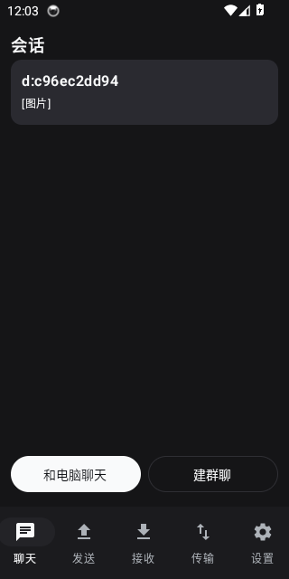
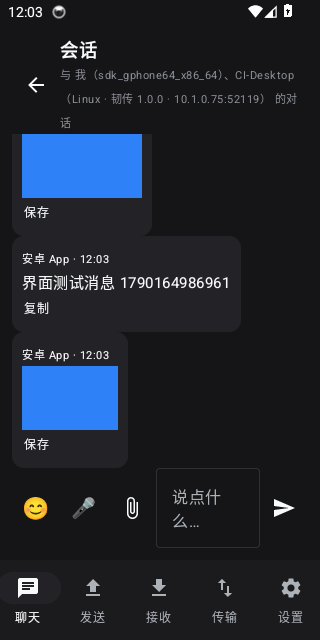
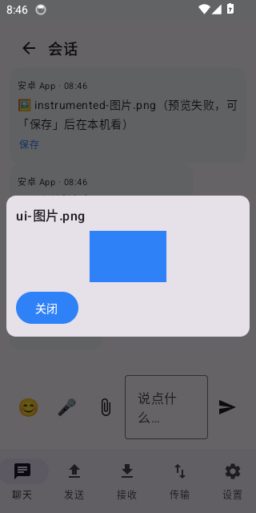

<div align="center">

# 韧传 · EverSend

**跨平台、绿色便携、专为大文件优化的文件互传工具 —— 断了能续传，坏了只补坏的那几块。**

**A portable cross-platform file transfer tool built for large files: it resumes after a drop and repairs only the damaged chunks.**

**简体中文** · [English](#-english)


[](https://github.com/xugulin/eversend/actions/workflows/ci.yml)
[](https://github.com/xugulin/eversend/actions/workflows/interop.yml)

</div>


## 📸 截图 · Screenshots

|  |  |
|---|---|
|  |  |
| **发送 · Send**<br>左边选设备、右边拖文件，实时速度与剩余时间<br>*Pick a device, drop files, live speed and ETA* | **传输 · Transfers**<br>多流并行进度、断流后自动补流继续<br>*Parallel-stream progress; reconnects by itself after a drop* |
|  |  |
| **设置 · Settings**<br>并行连接数、PIN、自动接收、加密状态<br>*Stream count, PIN, auto-accept, encryption state* | **手机连接 · Phone**<br>扫码即用，手机不装任何 App<br>*Scan and go — nothing to install on the phone* |

> 截图摄于本机实跑，默认 1080×760 窗口。
> *Captured from a real run at the default 1080×760 window.*

---

## 🇨🇳 简体中文

### 平台与验证 · Platforms & verification

| 平台 | 状态 | 怎么验证的 |
|---|---|---|
| **Linux** | ✅ 完整支持 | 作者实机 + GitHub Actions `ubuntu-latest` 原生 runner：40 项内核测试、17 项恶劣网络测试、7 项并发测试、187 项浏览器界面自检、25 项真点界面的交互测试、真 Qt 离屏渲染 |
| **Windows** | ✅ 完整支持 | GitHub Actions `windows-latest` 原生 runner 跑同一整套；另有 `interop.yml` 由 **Wine 承载真 Windows CPython + win_amd64 轮子**与 Linux 双向互传 24 MiB，逐字节比对；`ci.yml` 再把**绿色包解压到「我的 U 盘」这样的中文带空格路径**，用包里自带的解释器跑传输与界面 |
| **安卓 App** | ✅ 原生 App（推荐） | GitHub Actions 真机模拟器（API 34）**装真 APK 跑真机测试（12 项）**：真的连电脑、真的发带 emoji 的中文并回查电脑端收到、真的上传图片再按消息 id 取回逐字节比对、**真的把探针发出去并认出回包**、**真的扫网段找到正在运行的电脑（并断言覆盖整个 /24）**、**真的把附件写进系统「下载」**、**真的初始化内置播放器把一段音频放完**、**真的建一个群聊并核对成员**；界面级那条会点开会话、点开图片看全屏大图、点「复制」查剪贴板、点「保存」查 MediaStore，并把截图与界面树一起归档 |
| **安卓（网页版）** | ✅ 浏览器界面（零安装，保留） | 同一个模拟器 + 真 Chrome：CDP 把文件塞进页面的文件选择框再点发送，上传下载都逐字节比对 |
| **macOS** | ⚠️ 内核已验证，**界面未验证** | GitHub Actions `macos-latest` 跑完整内核测试（含 512 MiB 传输与内存上界），但作者没有 Mac，桌面窗口从未在真机上看过 |

> **这些不是"应该能跑"，是 CI 上真跑过。** 跨系统的测试至今抓到 4 个只在某个平台上
> 存在、在作者本机永远是绿的缺陷：`os.pread/os.pwrite` 在 Windows 上不存在、
> Windows 的 `os.open` 默认文本模式会悄悄改写二进制、Windows 上 `socket.sendmsg`
> 不存在、以及**手动接受的传输在 Windows 上会因为文件还被自己开着而重命名失败**
> （POSIX 允许重命名打开着的文件，所以 Linux 侧一直只表现为句柄泄漏）。
> 详见 [`docs/RESEARCH.md`](docs/RESEARCH.md) 与 `ci.yml` / `interop.yml` 里的注释。

### 这是什么

**韧传**是一个从零写的文件互传工具：局域网内点对点直连，不经过任何服务器；手机扫码就能用；
绿色包解压即用，**解压到 U 盘里也能跑**。

它的起点是两份源码的逐行研读：[LocalSend](https://github.com/localsend/localsend) 和
[RustDesk](https://github.com/rustdesk)。两者都很优秀，但在"稳定传大文件"这件事上各有
**设计层面**的硬伤，不是调参能解决的：

- **LocalSend 完全没有断点续传**：整个文件就是一个 HTTP POST，传到 99% 断了只能从 0 开始。
  它那个"重试 3 次"只对**校验和不匹配**生效，网络中断根本不在重试范围内。而且上传严格绑定
  源 IP —— 在多网卡机器上（Windows 上 Wi-Fi + Hyper-V + WSL 是常态）会直接 403。
- **RustDesk 的文件传输是"每 tick 一块"的定时器模型**：块固定 128 KiB、被控端 5 ms/tick，
  **26–29 MB/s 是设计硬顶**；块号字段恒为 0（没有偏移），无逐块 ACK、无滑窗、无重传；
  续传只靠 `(size, mtime 秒)`，没有内容哈希，偏移还是 `uint32`，**截断在 4 GiB**。

韧传保留了 LocalSend 那种"打开就能看见对方"的体验和 RustDesk 的穿透思路，把传输层整个换掉。
完整的解剖报告在 [`docs/RESEARCH.md`](docs/RESEARCH.md)。

### 为什么值得一试

**它的核心是"接收方驱动"。** 每一块数据都是接收方要来的，不是发送方推的。三个好处直接掉出来：

1. **续传免费** —— 续传日志在接收方手里，重连后它只是"不请求已经有的块"。不需要交换位图、
   不需要协商、不需要从头再来。
2. **负载自动均衡** —— 所有流从一个共享队列取任务，快的自然拿得多，不需要调参。一条流死了，
   它在飞的块回到队列被别的流接走。
3. **发送方无状态** —— 它只回答"第几块是什么"，无论多少条流，内存里永远只有一个块。

再叠一条：**块按文件顺序发放**，多条流合起来就是**从前往后顺序写盘**（机械硬盘上这是
120 MB/s 与 20 MB/s 的差距），并且让整文件哈希能边传边算，正常情况完全不用传完再读一遍。

### 功能一览

- **分片传输**：1–16 MiB 自适应分块，逐块 CRC32 + 整文件 BLAKE2b-256
- **断点续传**：断电、断网、关程序、拔 U 盘，下次接着传
- **坏块修复**：校验失败只重取坏的那几块 —— 100 GB 坏一个扇区，代价是 4 MB 而不是 100 GB
- **多连接并行**：默认 4 条最多 16 条，机械硬盘自动降为 2 条
- **断连自愈**：Wi-Fi 漫游、NAT 重绑定导致连接全灭后自动补流并完成
- **五种发现方式**：UDP 组播、UDP 广播、mDNS、主动子网扫描、手动 IP/二维码
- **传输加密**：Ed25519 身份 + X25519 协商 + AES-256-GCM/ChaCha20-Poly1305，6 位短认证串
- **手机零安装**：内置移动端网页界面，扫码即用，支持断点下载（HTTP Range）
- **绿色便携**：内置 Python 3.14.7，不写注册表、不写 `%APPDATA%`，只读介质也能启动

### 快速开始

**绿色版（推荐）**：从 [Releases](https://github.com/xugulin/eversend/releases) 下载对应的
zip，解压后

- **Linux**：`./run.sh`
- **Windows**：双击 `run.bat`

不需要装 Python、不需要装依赖、不需要联网。

**从源码**：

```bash
git clone https://github.com/xugulin/eversend
cd eversend
python3 -m venv .venv
.venv/bin/pip install PySide6-Essentials cryptography
PYTHONPATH=src .venv/bin/python -m eversend
```

**命令行**（无图形界面的服务器也能用）：

```bash
python -m eversend --cli serve --auto-accept   # 常驻收文件
python -m eversend --cli discover              # 看看局域网里有哪些设备
python -m eversend --cli send 文件 --to 192.168.1.42
python -m eversend --cli selftest              # 自检
```

### 聊天

局域网里的聊天，**电脑 ↔ 电脑走协议直连，手机走网页**，消息都存在电脑上
（`data_dir/chat.db`，SQLite）：

| 能力 | 状态 |
|---|---|
| 一对一聊天 | ✅ 会话 id 由双方设备 id 算出来（`d:<a>|<b>`），不需要协商 |
| 群聊 | ✅ 建群时选成员；每条消息携带群信息，所以当时不在线的成员下次收到消息就认识这个群了 |
| 文字 / 表情 | ✅ 完整 Unicode，页面和桌面端都有表情面板 |
| 图片 | ✅ 直接发原图（走文件传输通道，可续传、逐字节校验）。手机网页/安卓 App：气泡里就是缩略图，点开全屏；桌面端：气泡里是缩略图，点开是能切**原始大小**的查看器（可另存为）。**自己发出去的图片也能预览** —— 聊天记录里额外存了一条"本机路径"，只存本机、不进协议、也不给手机接口 |
| 视频 | ✅ 手机网页：气泡里 `<video>` 直接播；安卓 App：**应用内播放**（可拖进度）；桌面端：卡片 + 「打开」交给系统播放器（PySide6-Essentials 没有 QtMultimedia，这条限制写在界面上） |
| 文件 | ✅ 任意类型，带大小；安卓 App 有「保存」直接写进系统「下载」目录，桌面端点「打开」用本机默认程序 |
| 语音消息 | ✅ 手机按住 🎤 录音（需要 HTTPS 地址，见下），电脑端显示成语音条；<br>⚠️ 桌面端**窗口内不能播放**：绿色包用的是 PySide6-Essentials，没有 QtMultimedia，点「打开」交给系统播放器 |
| 视频/语音通话 | ⛔ 未实现。方案见 [`docs/CALLS_DESIGN.md`](docs/CALLS_DESIGN.md)：必须走 WebRTC，服务端只做信令，媒体点对点 |
| 群聊 | ✅ 三端都能建群、选成员、群发；手机端「建群聊」在会话页底部 |
| 多设备同时发送 | ✅ 桌面端点选多台（Ctrl/Shift）一次发出；安卓 App 勾选多台，每台各自汇报结果 |

**手机录音要 HTTPS。** 浏览器只在安全上下文里把麦克风交出去，而
`http://192.168.x.x` 不是。所以程序启动时会**自己生成一张自签证书**
（`data_dir/tls/`，用包里已有的 cryptography，SAN 覆盖本机所有局域网 IP），
在 52119 之外再开一个 **52120 的 HTTPS** 端口：

* 平时扫码用 `http://…:52119/`，扫码即用，什么都不用点。
* 要发语音就用 `https://…:52120/`。手机第一次打开会提示"不安全/继续访问"，
  点一次继续即可（自签证书必然如此，页面上也写明了）。私钥只留在本机。

### 手机怎么用

手机有两个入口，都保留：**安卓 App**（推荐）和**网页版**（零安装）。

|  | 安卓 App | 网页版 |
|---|---|---|
| 熄屏 / 锁屏 / 切后台 | ✅ 前台服务常驻连接，照常收消息 | ❌ 页面被系统冻结，连接会断 |
| 语音消息 | ✅ 直接录（权限在 App 手里） | ⚠️ 需要 HTTPS 地址（浏览器只在安全上下文给麦克风） |
| 系统通知（锁屏可见） | ✅ | ❌ |
| Emoji | ✅ 系统彩色 emoji | ✅ 系统彩色 emoji |
| 安装 | 装一个 APK | 什么都不用装，扫码即用 |

**网页版吃亏在浏览器的硬限制**：熄屏、后台挂起、麦克风要 HTTPS——这些改不了，所以才
做了原生 App。两个入口各有用途：临时给别人的手机传个文件，扫码最快；自己的手机日常用，
装 App。

App 真机截图（CI 上真模拟器跑完测试后自动截的，Emoji 由系统字体渲染，和微信、相册一个水平）：

| 会话列表 | 聊天：图片直接显示、可复制、可保存 | 点开看大图 |
|---|---|---|
|  |  |  |

装法：下载 `EverSend-1.0.0-android.apk` 安装即可（**debug 签名**，自用/测试没问题；
正式分发请用自己的密钥重新签名）。打开后点「搜索电脑」自动发现，也可以手填地址。

**不翻墙也能装**：把 APK 放进韧传目录（或 `data` 目录，名字里带 `eversend` 或 `韧传`
即可，如 `EverSend-android.apk`），手机打开网页版就会多出一张「装安卓 App」卡片，
点一下直接从这台电脑下载安装——手机本来就在和它说话，不需要经过互联网。
打包时（`tools/build_green.py`）如果 `dist/EverSend-android.apk` 或
`android/app/build/outputs/apk/debug/app-debug.apk` 存在，也会自动放进绿色包。

App 有 5 个页签：**聊天 / 发送 / 接收 / 传输 / 设置**，不是只有一个聊天窗口：

| 页签 | 能做什么 |
|---|---|
| 聊天 | 一对一/**群聊**（可自建群、选成员），文字、Emoji、图片、视频、文件、语音；**图片直接显示缩略图，点开全屏看大图**；**视频点开在应用内播放**；**语音点一下就能听**；每条都有「复制」（真的进系统剪贴板）和「保存」（真的写进系统「下载」目录） |
| 发送 | 选文件/选图后传到电脑，**可勾选多台设备一次发给它们**；每台设备都标着「已连接 / 未连接 · 最后在线 X」 |
| 接收 | 电脑发来的文件在这里，点「保存到手机」写进「下载」目录 |
| 传输 | 当前传输与历史，成功/失败/已保存一目了然 |
| 设置 | 电脑地址、连接状态、设备名、断开连接 |

**内置播放内核。** 语音和视频在 App 里用 **libVLC**（LGPL，自带 FFmpeg）播放，
安卓系统解不了的 MKV/HEVC、网页录的 webm/opus、App 录的 m4a 都能放 —— 用户明确
要求"不要调用系统的，以防系统没有这个能力报错"。代价是 APK 变大：按 ABI 分包后
手机那份 **71 MB**（arm64），CI 的模拟器那份 79 MB（x86_64）。版本上有个坑：
libvlc-all 的 Maven `<release>` 是 4.0.0-eap，要求 minCompileSdk=36，本项目是
compileSdk 34，**3.7.2 是仍然兼容的最后一版**。

桌面端不背这个体积：PySide6-Essentials 既没有音频输出也没有视频控件（要真在窗口
内播放得换 Qt Addons，+160 MB）。所以 `core/media.py` 是**有 FFmpeg 就用**：
出视频封面帧（聊天里就是真缩略图）、报时长、用 ffplay 窗口内播放语音与视频；
没有就退回卡片 + 系统播放器。想要内置，跑 `tools/fetch_ffmpeg.py` 再
`build_green.py --ffmpeg`（LGPL 构建，代价是包大 100-260 MB，默认不开）。

**发现是双向的，手机找电脑有整整三条路，任何一条通就行**：

| 顺序 | 怎么找 | 什么情况下有用 |
|---|---|---|
| 1 | **安卓自带 mDNS**（`NsdManager` 查 `_eversend._tcp`，电脑端立刻回一条 PTR/SRV/TXT/A） | 网络允许 5353/UDP 组播时最快，几百毫秒出结果 |
| 2 | **UDP 探针**：往每个网卡的**定向广播地址**、**子网内每一台主机**、全局广播、组播各发一条，电脑端收到就**立刻单播回一条** | 广播没被拦的常见家用网 |
| 3 | **TCP 扫网页端口**：`/24` 网段 254 台逐台敲 52119，谁答"我是韧传"就是电脑 | UDP 被 ROM / 路由器拦掉时唯一还通的路 —— "能打开网页就说明通了" |

为什么不能只发 `255.255.255.255`：手机做热点时默认网络是**移动数据**，这个包按
路由表会走蜂窝那一侧（或被 ROM 直接丢掉），根本到不了热点子网。TCP 那条当初也
只扫到第 150 台左右（6 秒预算 ÷ 12 并发），用户的电脑在 `.177`，正好漏在尾巴上。

电脑反过来看手机：App 一连上就 `POST /api/hello` 报上自己的设备号（显示为
「我的手机（安卓 App）」），并每 5 秒广播一次自己的公告。

换网、换设备、换端口都不用管：端口从来是发现结果里带回来的（mDNS 的 TXT、UDP 公告
都写着网页端口），TCP 兜底除了默认端口还会试"上次连过的那个端口"。**几千几万个
设备的大网段**（办公室 /16、校园网）不会逐台扫 —— 那既不现实也不礼貌：桌面端与
手机端都退一步扫"自己所在的那个 /24"（手机再加上上次那台电脑所在的 /24）。

只"听见"过（发现端口上广播过一次）的设备算**临时记录**：真发过 HTTP 请求就转正，
90 秒内再没动静就自动忘掉 —— 否则每台点过一次「搜索电脑」的手机、每次自检发的
探针，都会在用户的配对列表里留一条。

**App 里那个地址栏填什么**：电脑窗口顶上第二行就是「手机访问（App 里填这个）：
`http://192.168.x.x:52119/`」。填成传输端口（52117）也不会白填：App 会先按你填的
端口试，不通就自动改试 52119/52120，并告诉你用了哪个。

手机**只要连过一次就会被记住**（写进 `data_dir/web_clients.json`）：熄屏、切到别的
App、甚至把浏览器整个关掉，它都留在设备列表里，状态只是从「在线」变成
「未连接 · 最后在线 3 分钟前」—— **不需要为了保持配对而让手机一直亮着**。
想让它彻底消失，只有在手机上点「断开连接」，或者在电脑上右键那台设备选「移除」。

选择接收设备时，每台设备是一张大卡片：34px 平台图标、设备名（会换行）、
`类型 · 系统 · 版本 · ID`、`地址 · 怎么发现的 · 最后在线`，右侧一个状态徽标
（在线 / 未连接 / 已信任 / 本机实例）。名字相近的两台设备靠设备 ID 区分，避免发错人。
悬停能看到完整信息，包括对方自报的地址列表。

手机出现在三处：**左侧设备列表里的卡片**、扫码弹窗的状态行、
「设置 → 已连接的手机」。（这些同时是接口 `/api/state` 的 `webClients` /
`knownClients` 字段，脚本一样能查。）

**两个方向都能用，但机制不同，界面上也如实写明：**

- **手机 → 电脑**：手机上选文件，页面直接传过来（单个文件上限 32 GB）。
- **电脑 → 手机**：选中设备列表里那台手机，点「发送」——文件会被**交给手机页面**，
  手机「接收」页出现「电脑发来的文件」，点一下「下载」就取走（HTTP Range 断点续传）。
  浏览器里没有常驻的接收服务，所以这不是推送，而是一次交接；传输行会显示
  「已放到手机页面，等它在手机上点下载」，手机取走后变成「手机已取走」。
  把这件事说清楚，比给一个永远不会到达的「已发送」要好。

脚本也能做同样的事（仅本机可调）：

```bash
TOKEN=$(curl -s http://127.0.0.1:52119/ | grep -o 'name="eversend-token" content="[^"]*"' | cut -d'"' -f4)
curl -X POST -H "X-EverSend-Token: $TOKEN" -H 'Content-Type: application/json' \
     -d '{"paths":["/home/me/报告.pdf"]}' http://127.0.0.1:52119/api/share
```

这个界面是纯本地页面：没有 CDN、没有外部字体、没有构建步骤，**手机没外网也能用**。

### 实测数据

| 项目 | 结果 |
|---|---|
| 本机吞吐（4 流，加密开启） | **110 MiB/s**（千兆网卡的理论上限是 118） |
| 绿色包 500 MB 端到端 | 2.9 秒，SHA-256 逐字节一致 |
| 恶劣网络（8 次 RST 杀连接 + 限速） | **仍然逐字节一致送达** |
| 512 MiB 传输峰值内存 | 234 MiB，不随文件大小增长 |
| Linux → Windows（Wine 承载） | 24 MiB，双向逐字节一致 |
| Windows 绿色包（包里自带的解释器） | 24 MiB 真传 + 内置 Qt 建窗口 + `run.bat --selftest`，CI 在真 Windows runner 上跑 |
| 电脑 → 手机（真浏览器） | CI 里把文件交给手机页面，真 Chrome 点「下载」取走，逐字节一致，桌面端确认已被取走 |
| 手机 → 电脑（聊天） | CI 里真 Chrome 打开聊天页、输入并发送，电脑端的聊天库里必须出现那句话 |

### 测试

```bash
python tests/test_loopback.py            # 40 项：基本传输/目录/续传/坏块修复/取消/吞吐/手动接受/身份自愈
python tests/test_resilience.py          # 17 项：RST 杀连接/限速/512MiB/内存上界/对端不回话就挂断
cd android && gradle assembleDebug       # 安卓 App（Kotlin + Compose，无第三方依赖）
python tests/test_chat.py                # 33 项：会话存储/一对一/群聊扇出/附件落位
python src/eversend/web/selftest.py      # 187 项：QR/CSRF/路径穿越/Range/完整收发链路/交给手机/APK 下载/App 登记/发现回包/mDNS 回答/本机路径不外泄
xvfb-run -a python tests/test_gui_actions.py   # 25 项：真的点界面（取消/发送到底/聊天图片预览/多选发给两台）
python tests/test_interop_wine.py --stage tools/.cache/stage-windows   # Linux ↔ Windows 双向
python tools/ci_android_http.py          # 手机页面的 HTTP 表面（上传/Range/SSE/安全边界）
```

> 测试默认把临时数据放在项目下的 `.testscratch/`，**不占 `/tmp`** —— `/tmp` 常常是小容量
> 的 tmpfs，而这些测试会故意写几百 MiB 的文件。可以用 `EVERSEND_TEST_TMP=/dev/shm` 覆盖。

### 文档

| 文档 | 内容 |
|---|---|
| [`docs/RESEARCH.md`](docs/RESEARCH.md) | LocalSend 与 RustDesk 的逐行解剖：原理，以及两者在大文件/稳定性上的根因 |
| [`docs/PROTOCOL.md`](docs/PROTOCOL.md) | 线协议规范 v1：分帧、双向认证握手、AEAD、分片、恢复、发现 |
| [`docs/ARCHITECTURE.md`](docs/ARCHITECTURE.md) | 模块架构、线程模型、五条不变式、性能取舍 |
| [`docs/REMOTE_DESIGN.md`](docs/REMOTE_DESIGN.md) | 远程（互联网）传输设计：会合 + TCP 打洞 + 中继 |
| [`docs/PACKAGING.md`](docs/PACKAGING.md) | 绿色包打包说明 |
| [`docs/CALLS_DESIGN.md`](docs/CALLS_DESIGN.md) | 音视频通话方案（WebRTC + 自建信令），暂未实现 |
| [`android/`](android/) | 安卓原生 App（Kotlin + Jetpack Compose）：聊天、附件、语音、前台服务 |

### 已知限制

- **音视频通话没有实现**：方案写在 [`docs/CALLS_DESIGN.md`](docs/CALLS_DESIGN.md)。
  浏览器里通话必须走 WebRTC，而桌面端是 Python —— 要在原生窗口里参与通话，就得自己
  实现 ICE/DTLS-SRTP，或者改用带 QtWebEngine 的 PySide6-Addons（绿色包 +100 MB 左右）。
  这一步按你的需要再决定。
- **桌面端不能在窗口里播放语音**：绿色包用的是 PySide6-Essentials，不含 QtMultimedia，
  收到的语音点「打开」交给系统播放器。
- **远程（互联网）传输只有设计，没有实现。** 方案写在 [`docs/REMOTE_DESIGN.md`](docs/REMOTE_DESIGN.md)，
  接口留在 `src/eversend/remote/`。局域网部分已完整交付并实测。
- **macOS 界面从未实机验证过。** CI 会跑完整内核测试（含 512 MiB 与内存上界），作者没有 Mac，
  所以窗口长什么样、便携包能不能双击启动，都还没人看过。
- **Windows 绿色包已经能被 `cmd.exe` 真正启动**：CI 在真 Windows runner 上执行
  `cmd /c run.bat --selftest`（批处理解析、参数转发、内置解释器、回环传输全过），
  并用包里的 `python.exe` 跑完传输、加密与 Qt 建窗口。**没有**验证的只剩"双击时
  弹出的那个窗口长什么样"——那需要有人坐在 Windows 前面看。
- **安卓 App 是桌面端的客户端，不是协议对端。** 它走的是手机页面那套 HTTP 接口
  （所以能收发文件、聊天、语音），但不参加点对点加密握手——真正的对端是那台电脑。
  好处是功能迭代不用动协议，代价是电脑必须开着。**APK 是 debug 签名**，自用和测试没问题，
  正式分发请用自己的密钥重新签名。
- **同名文件会续传/覆盖，不会自动改名。** 这是续传语义的必然结果；需要保留两份请手动改名。
- **桌面端窗口内播放要自带 FFmpeg**：PySide6-Essentials 既没有音频输出也没有视频控件。
  有 FFmpeg 时视频出封面帧、语音/视频用 ffplay 窗口内播放（`tools/fetch_ffmpeg.py` +
  `build_green.py --ffmpeg`，可选，包会大 100-260 MB）；没有就退回卡片 + 系统播放器。
  安卓 App **默认就内置** libVLC（自带 FFmpeg），所以手机端开箱即用。
- **手机端是"电脑的客户端"**：手机之间不能直连，发给另一台手机的流程是"上传到电脑 →
  电脑把它交给那台手机的页面"。群聊、多选发送都走这条链路，所以电脑必须开着。
- **取消是"取消"，不是"失败"**：引擎把用户取消报成 `cancelled`（发送侧、接收侧、对端取消
  都算），卡片显示「已取消」且按钮变灰；只有真的出错才是红色「已失败」。

### 联系与支持

发现问题请开 [Issue](https://github.com/xugulin/eversend/issues)，附上 `--selftest` 的输出和
CI 上的失败日志，定位会快很多。

---

## 🇬🇧 English

### What is it

**EverSend** is a from-scratch peer-to-peer file transfer tool. On a LAN it connects devices
directly with no server involved; phones join through a browser (or the native app), so
nothing needs installing on the computer.
The portable build is a zip you unzip and run — **it works from a USB stick**.

It started as a line-by-line study of [LocalSend](https://github.com/localsend/localsend) and
[RustDesk](https://github.com/rustdesk). Both are excellent, but both have *design-level*
problems with large files:

- **LocalSend has no resume at all.** The whole file is one HTTP POST, so a drop at 99% means
  starting over. Its "retry 3 times" applies only to *checksum mismatches* — a broken
  connection is not retried. Uploads are also pinned to the source IP, which returns 403 on
  any multi-homed machine (Wi-Fi + Hyper-V + WSL is normal on Windows).
- **RustDesk transfers files on a timer**, one fixed 128 KiB block per tick. That caps it at
  roughly 26–29 MB/s by construction. The block id field is never assigned, there is no
  per-block ACK or window, and resume relies on `(size, mtime)` with no content hash and a
  `uint32` offset that truncates at 4 GiB.

EverSend keeps the zero-configuration discovery of the first and the NAT-traversal thinking of
the second, and replaces the transfer layer entirely.

### Why you'll like it

**The receiver drives the transfer.** Every chunk is pulled by the receiver, never pushed.
Three things fall out of that:

1. **Resume is free** — the journal lives on the receiving side, so after an interruption it
   simply does not ask for what it already has.
2. **Load balances itself** — all streams pull from one queue; a fast one takes more. If a
   stream dies, its in-flight chunks go back on the queue.
3. **The sender is stateless** — it answers "what is chunk N", holding one chunk in memory no
   matter how many streams exist.

Chunks are also handed out in file order, so parallel streams write front to back — 120 MB/s
versus 20 MB/s on a spinning disk — and the whole-file hash is computed while the transfer
runs instead of in a second pass.

### Features

- Chunked transfer (1–16 MiB, auto-sized), per-chunk CRC32 plus whole-file BLAKE2b-256
- **Resume** across power loss, disconnection, application restart
- **Chunk-level repair**: a failed checksum costs one bad chunk, not the whole file
- 4 parallel streams by default (up to 16; 2 on a spinning disk)
- Survives every connection dying at once — the sender reconnects on its own
- Five discovery channels: multicast, broadcast, mDNS, subnet scan, manual / QR
- Encrypted: Ed25519 identity, X25519 agreement, AES-256-GCM or ChaCha20-Poly1305
- Zero-install Android via the built-in mobile web UI, with ranged downloads
- Bundled playback: the Android app ships libVLC (its own FFmpeg) so voice and video play
  without depending on the device's codecs; the desktop uses a bundled FFmpeg when present
- A native Android app (Kotlin + Compose) that keeps the link alive in the background,
  finds the computer on the LAN (directed broadcast, a per-host unicast sweep and a TCP
  fallback for networks that drop UDP), previews images, plays video and voice in-app,
  copies message text to the system clipboard and saves attachments to Downloads
- Cancelling a send says "cancelled", not "failed", and the card stops immediately
- Portable: embedded Python 3.14.7, no registry, no `%APPDATA%`, runs read-only

### Platforms & verification

| Platform | Status | How it was verified |
|---|---|---|
| Linux | ✅ Full | Author's machine + GitHub Actions: 40 core, 17 resilience, 7 concurrency and 158 browser-UI checks, plus a 512 MiB transfer |
| Windows | ✅ Full | GitHub Actions `windows-latest` runs the whole suite, **plus** a bidirectional Linux ↔ Windows transfer with a real Windows CPython under Wine, **plus** the portable zip unzipped into a path with spaces and Chinese characters, launched through `cmd /c run.bat --selftest` and driven by its own bundled interpreter |
| Android | ✅ Native app + browser UI | A real Android emulator on CI: the debug APK is installed and instrumented (it connects, sends a Chinese message with emoji and verifies it landed, uploads an image and fetches it back byte for byte), **and** Chrome drives the browser page: files uploaded and downloaded through it and compared byte for byte |
| macOS | ⚠️ Core verified, GUI not | CI runs the full core suite (including a 512 MiB transfer and the memory bound), but no Mac was available to look at the window |

### Quick start

Grab a zip from [Releases](https://github.com/xugulin/eversend/releases), unzip, then
`./run.sh` on Linux or `run.bat` on Windows. Nothing to install.

### Known limitations

- Remote (internet) transfer is **designed but not implemented** — see
  [`docs/REMOTE_DESIGN.md`](docs/REMOTE_DESIGN.md).
- macOS has never been run.
- The Android app is a client of the desktop's HTTP API, not a protocol peer, so the
  computer has to be running. The APK is debug-signed; sign it with your own key to
  distribute it.
- Sending the same filename twice resumes or overwrites; it does not auto-rename.

### License

MIT
